# Report of Exploration tests

#### Test Environment

| Setting | Value |
| ---- | --- |
| Broser | Chrome 114.0.5735.106 |
| Screen Size | 1344x840 |
| OS | OS X 12.6.5 |
| Screen Size | https://qainterview.pythonanywhere.com/ |

---

 🟡 ID-1: Page title typo

## Description:
`When accessing to the test page, the tab is named “Factoriall” with an extra “L” at the end`

### Attachments:

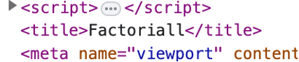

---

 🔴 ID-2: No message on negative number input 

### Description:
`When trying a negative number, the page doesn’t return any message. The server responds with a 500 but it should have been a 400 Bad Request. There should have been a condition that would catch non valid inputs, not only strings.`

### Attachments:
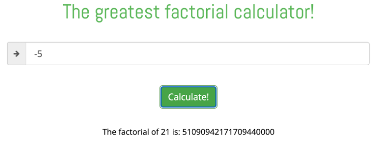
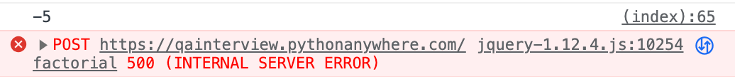

---

 🔴 ID-3: Calculating a number higher than 171 is returning Infinity 

### Description:
`The calculator is returning "Infinity" as factorial of every number starting from 171, however posting directly the calculation to the API it returns the correct value`

### Attachments:
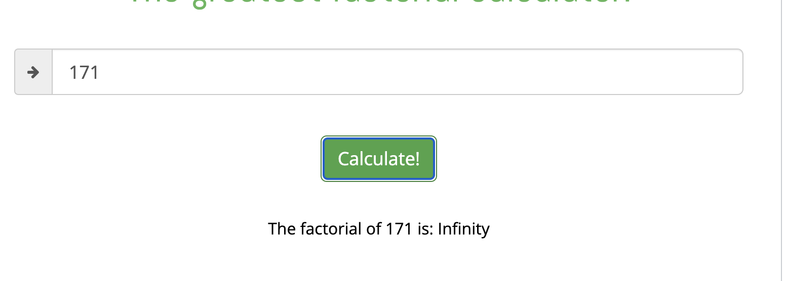
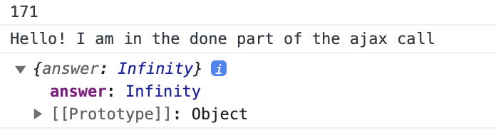
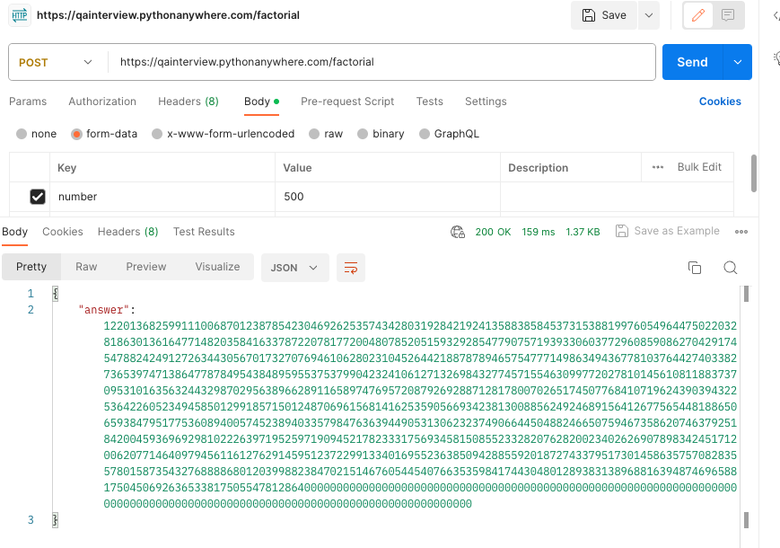

---

 ⛔ ID-4: Calculating any number higher than 991 is returning a 500 internal server error 

### Description:
`The calculator is returning 500 internal server error for numbers higher than 991`

### Attachments:
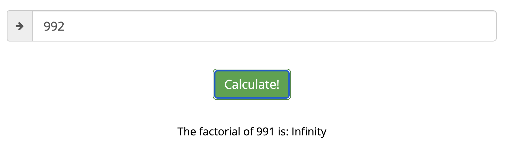
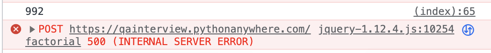

---

 🟡 ID-5: For numbers higher that 21, the webpage is showing the exponential instead of natural number 

Priority: Improvement

### Description:
`For numbers higher that 21, the webpage is showing the exponential instead of natural number, however the API is still returning the natural number `

### Attachments:
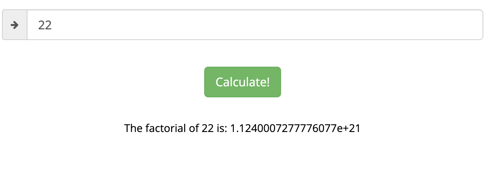
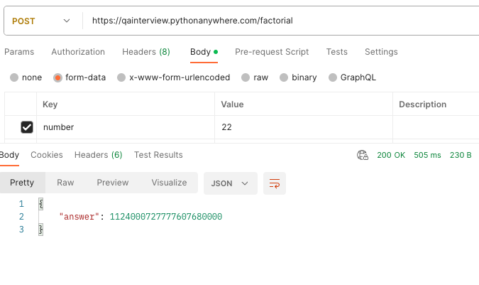
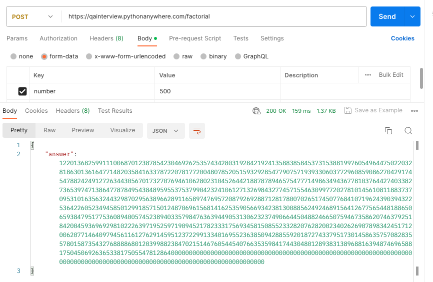

